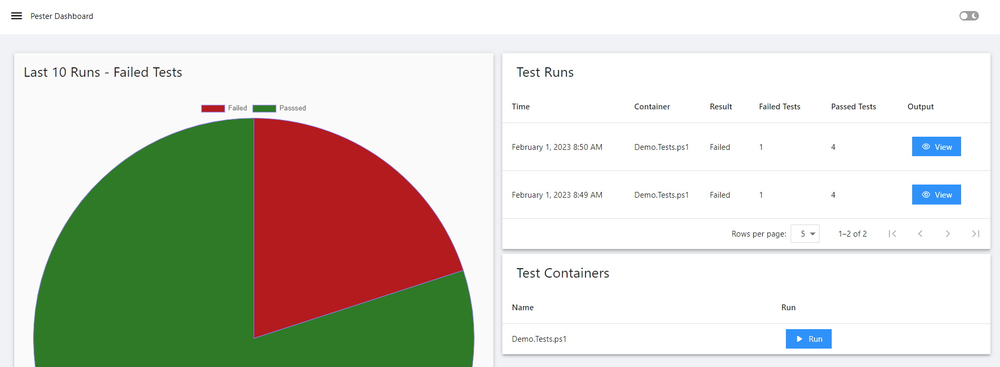
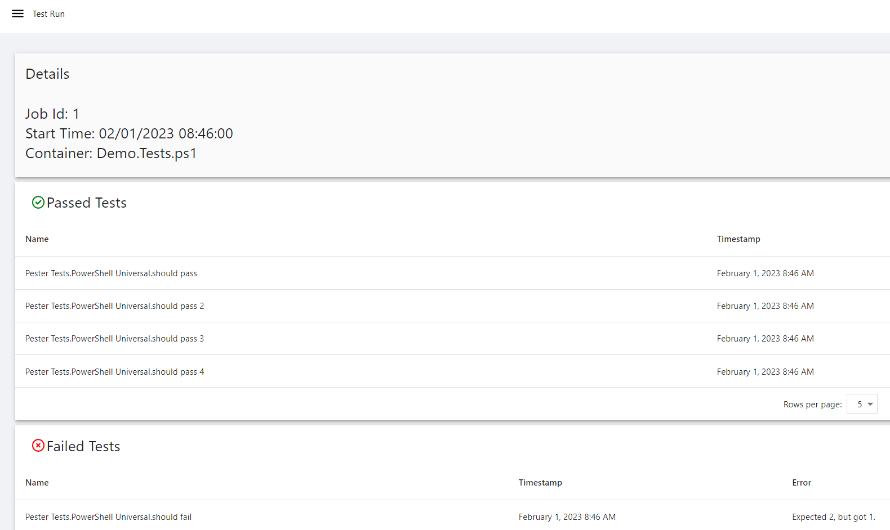

# Pester Dashboard

## Test Dashboard 



## Test Run



This dashboard is capable of locating and running Pester containers. It will automatically load `*.Test.ps1` files from the repository directory.

This dashboard requires the `Pester` module to be installed. 

```powershell
Install-Module Pester
```

This template includes:

- Script to run Pester tests by file name
- Chart displaying failed\passed tests
- Table to view previous test runs
- Table to execute Pester tests
- Details page for test results